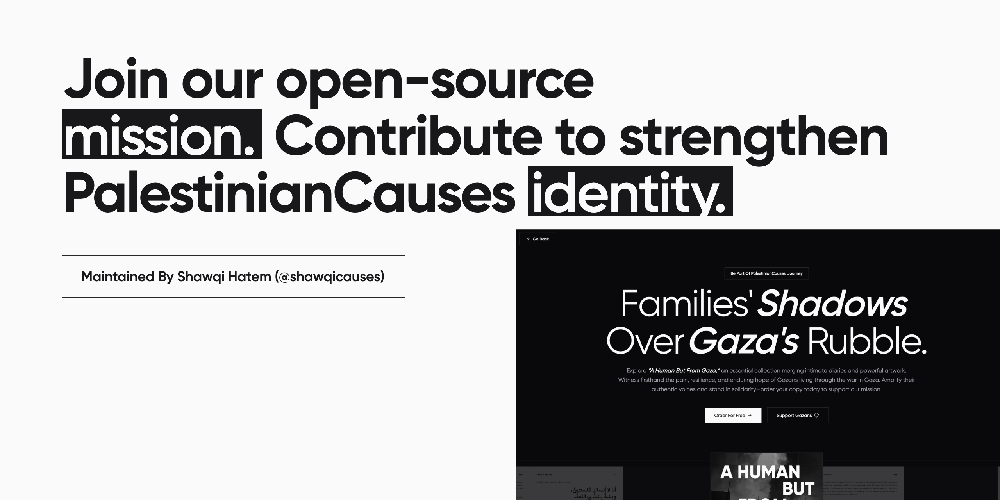

<!-- REVIEWED - 02 -->

# PalestinianCauses.com

Welcome to the open-source repository for the PalestinianCauses website! This platform is a digital home to illuminate the Gazan experience, amplify authentic voices, and build solidarity.

We aim to share vital narratives from Gaza and beyond, like those in our project "A Human But From Gaza" and The Truth Museum, while building a sustainable foundation for Gazan empowerment.

This repository contains the codebase for the website at [PalestinianCauses.com](https://palestiniancauses.com). We believe in transparency and collaboration, and we're opening our code for others to learn from, use, and contribute to.

## What You'll Find and Learn

Explore the codebase and gain practical experience with:

- **Next.JS and React.JS**: Building modern, server-rendered, and client-side web applications.
- **Server Components and Server Actions**: Utilizing key Next.JS features for performance and back-end interactions.
- **Client Components**: Developing interactive user interfaces.
- **Payload CMS**: Implementing this Headless CMS as a powerful content management and back-end solution integrated with Next.JS.
- **Migrations**: Managing database schema changes.
- **React Query**: Effective data fetching, caching, and state management.
- **Custom Hooks**: Creating reusable logic for your React components.
- **Form Management**: Handling user inputs and data submissions reliably.
- **Data Modeling**: Designing efficient structures for content and application data.
- **Fetching Data**: Strategies for retrieving data from the back-end.
- **Rendering Data**: Displaying data efficiently on the front-end.
- **Filtering Data**: Building logic for searching and filtering content.
- **Writing Tests in PlayWright`**: Building end-to-end tests for application reliability.
- **Best Practices:** Applying clean code principles and effective development patterns across the project.
- **SEO**: Implementing search engine optimization best practices.
- **Authentication (Auth)**: Implementing secure user authentication flow and access control.
- **More...**

## Contributing

We welcome contributions from developers interested in using their skills for impactful projects. Whether fixing bugs, adding features, improving documentation, or refactoring code, your help strengthens this platform and supports our mission.

## Get Started

Ready to dive in?

1. Clone the repository: `git clone https://github.com/PalestinianCauses/palestiniancauses.com`
2. Install dependencies: `pnpm install` (or `npm install`)
3. Start the development server: `pnpm run dev` (or `npm run dev`)
4. Explore the code and contributing guidelines!

## Support PalestinianCauses

Our work relies on solidarity and support.

- Visit our [website](https://palestiniancauses.com).
- Learn more about our [mission](https://palestiniancauses.com/about-us)
- Get ["A Human But From Gaza"](https://palestiniancauses.com/a-human-but-from-gaza)

Thank you for your interest and support! Together, we amplify truth and foster resilience.

Developed and Maintained By [Shawqi Hatem](https://instagram.com/shawqicauses).
